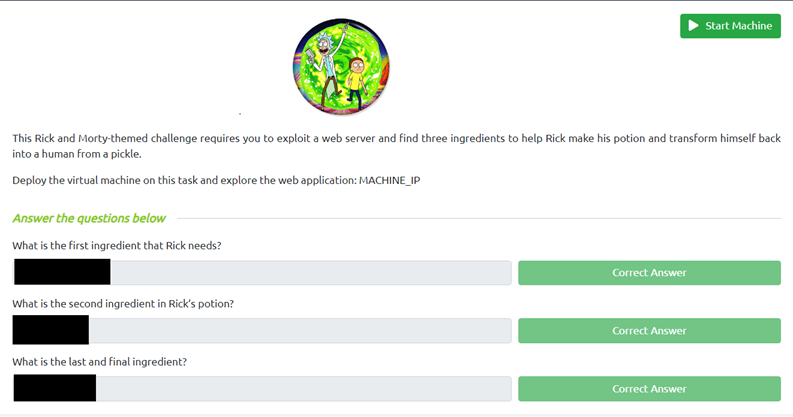

# Pickle Rick
#### A Rick and Morty CTF. Help turn Rick back into a human!
TryHackMe: [Pickle Rick CTF Link](https://tryhackme.com/room/picklerick)
Tools: Nmap, Nikto, Dirbuster, Bash/Python Reverse Shell, and Popcorn

---
## Preparation 
  
 

If you are using your own machine continue below otherwise launch your machine and skip to Scanning
First step is to open your favorite text editor (sublime,notepad++,onenote, etc). Copy and paste the question. 
Find your ip address by going to `ip address| grep inet` take a note of it or save it into a variable `export $IP=[your ip here]`.

## Scanning and Enumeration

To begin you are giving an IP address to go to. Launching it you will see a website, we can see that the message on the web is asking to look for a password. So with this knowledge we need to look for login credentials and a login portal. 

Note: Replace $Attack_IP with the target ip 
Lets go ahead and run an nmap scan, I run a simple nmap scan but you can run with any parameter you like.
`nmap -A -sT $Attack_IP` 
After few seconds we can see two ports that are open 80(http) and 22(ssh). Now we will scan for more and see what else we ccan find. Lets run nikto and dirbuster at the same time on two different terminal.
`nikto -h $Attack_IP` `dirb http://$Attack_IP`
Quite interesting, we find a robot.txt during from our dirbuster scanning, and we were able to find out how to get into the login portal. 

Now that we done with scanning and enumeration we can now head back to the webpage.

